# Introduction

# Setup Instructions

# Dataset

# Methodology

## 1. Part A

## 2. Part B

Part B focuses on face mask detection using a Convolutional Neural Network (CNN).  The approach involves these key steps:

1.  **Data Loading and Preprocessing:**
    *   A custom `FaceMaskDataset` class (PyTorch Dataset) is created to handle loading images and their corresponding labels ("with_mask" or "without_mask").
    *   Images are loaded using OpenCV (cv2), converted from BGR to RGB color space, and resized to a consistent size of 128x128 pixels.
    *   Data augmentation is applied using `torchvision.transforms`:
        *   `RandomHorizontalFlip`: Randomly flips images horizontally.
        *   `RandomRotation(20)`: Randomly rotates images by up to 20 degrees.
        *  `Normalize`: Normalizes the pixel values using pre-calculated mean and standard deviation values (`[0.5748376, 0.49752444, 0.46703878]` and `[0.25625145, 0.24203679, 0.23397043]`, respectively).
    *   The dataset is split into training (80%) and validation (20%) sets using `torch.utils.data.random_split`.
    *   PyTorch `DataLoader`s are used to create batches of data for training and validation, enabling efficient GPU utilization. The batch size of 128 and `num_workers` are configured.

2.  **Model Definition (CNN):**
    *   A flexible CNN architecture is defined using PyTorch's `nn.Module`.
    *   `ConvBlock`:  A reusable convolutional block is defined, comprising a convolutional layer (`nn.Conv2d`), optional batch normalization (`nn.BatchNorm2d`), an activation function (ReLU, LeakyReLU, ELU, Tanh, or Sigmoid), and an optional pooling layer (Max or Average Pooling).
    *   `CNN`:  The main CNN class is highly configurable:
        *   `in_channels`: Number of input channels (3 for RGB images).
        *   `num_classes`: Number of output classes (2 for "with_mask" and "without_mask").
        *   `conv_channels`:  A *list* specifying the number of output channels for *each* convolutional layer.
        *   `kernel_sizes`, `pool_types`, `pool_sizes`, `activations`: Lists specifying the parameters for each convolutional block.  The `_extend_param` method ensures these lists are the correct length, repeating the last element if necessary.
        *   `use_batch_norm`:  A boolean flag to enable/disable batch normalization.
        *   `fc_sizes`: A list specifying the sizes of the fully connected layers.
        *   `dropout_rates`:  A list of dropout rates for the fully connected layers.
        *   `final_pool_size`:  The output size of the adaptive average pooling layer (`nn.AdaptiveAvgPool2d`) before the fully connected layers. This makes the network less sensitive to the input image size.
    *   The model architecture consists of a sequence of `ConvBlock`s, followed by adaptive average pooling, flattening, and then a series of fully connected layers with dropout and the specified activation functions.  The final layer has `num_classes` output units.

3.  **Training:**
    *   The `train_model` function handles the training loop:
        *   Device Selection:  Uses CUDA (GPU) if available, otherwise falls back to CPU.
        *   Optimizer: Supports Adam, AdamW, and SGD optimizers.
        *   Loss Function:  Uses `nn.CrossEntropyLoss` (appropriate for multi-class classification).
        *   Epochs and Batches: Iterates through epochs and batches of training data.
        *   Forward and Backward Pass:  Calculates predictions, loss, performs backpropagation, and updates model weights.
        *   Progress Bar (tqdm):  Displays a progress bar with training loss and accuracy.
        *   Validation:  Evaluates the model on the validation set after each epoch, calculating validation loss and accuracy.
        *   Metric Logging: Stores training/validation loss and accuracy for later plotting.

4.  **Evaluation:**
    *   The `train_model` function returns both the trained model and a dictionary containing the training history (losses and accuracies).  This history is used to plot learning curves.

## 3. Part C

For this task, the first 500 images inside the folder <b>MSFD/1/face_crop</b> were segmented. To segment each image, the following steps were carried out:

1. Convert the image to grayscale.
2. Apply a Gaussian filter of size <b>3x3</b> with a standard deviation of <b>0.5</b> on the grayscale image to remove any noise present.
3. Apply Canny edge detection on the  smoothed out image. The thresholds used were <b>20</b> and <b>100</b>.
4. After finding the edges, contours of the edges were found. Next, the bounding boxes were computed for each contour.
5. Initialize two images <b>segmented_image1</b> and <b>segmented_image2</b> to be completely black. One of these is chosen to be the final output. Then iterate through the bounding box for each contour and do:  
(a) Apply binary and inverse binary thresholding on the corresponding part of the blurred grayscale image. Otsu thresholding method was chosen to adapt to different types of images.  
(b) Add one image to <b>segmented_image1</b> and the other to <b>segmented_image2</b>.
6. For both the segmented images, make the <b>top 60%</b> of the image as black. 
7. The image which has a greater number of white pixels is chosen to be the segmented image. The same is saved in <b>Output/PartC</b>.
8. The IoU score is calculated using the ground truth segmented output given in the <b>MSFD/1/face_crop_segmentation</b> folder.

## 4. Part D

The core of Part D focuses on semantic segmentation of face masks in images using a U-Net model.  The steps involved are:

1.  **Data Loading and Preprocessing:**
    *   The `MSFDDataset` class handles loading image-segmentation pairs, resizing them to a consistent size (128x128), converting them to PyTorch tensors, and applying normalization to the image data.
    *   DataLoaders are created for both training and validation sets to efficiently feed data to the model during training.

2.  **Model Definition (U-Net):**
    *   A flexible U-Net architecture (`UNet` class) is implemented.  This allows for configurable depth, base filter count, activation function (ReLU, LeakyReLU, or ELU), batch normalization, and dropout.
    *   The U-Net consists of an encoding path (contracting) and a decoding path (expanding) with skip connections.
    *   The encoding path downsamples the input image through convolutional blocks and max pooling, capturing features at different scales.
    *   The decoding path upsamples the feature maps using transposed convolutions and concatenates them with corresponding feature maps from the encoding path (skip connections).
    *   A final 1x1 convolution maps the output to the number of segmentation classes (256 in this case, representing pixel intensity levels in the grayscale masks).

3.  **Training:**
    *   The model is trained using the Adam optimizer and Cross-Entropy loss.
    *   The `train_model` function performs the training loop:
        *   Iterates through epochs.
        *   For each epoch, iterates through batches of training data.
        *   Performs forward pass, calculates loss, performs backward pass, and updates model weights.
        *   Calculates and logs training loss.
        *   Evaluates the model on the validation set after each epoch.
        *   Calculates and logs validation loss, accuracy, Intersection over Union (IoU), and Dice score.

4.  **Evaluation:**
    *   The trained model is evaluated on the validation set.
    *   Key metrics:
        *   **Validation Loss:** Measures the model's error on the validation set.
        *   **Validation Accuracy:**  The percentage of correctly classified pixels.
        *   **Validation IoU (Intersection over Union):** Measures the overlap between predicted and ground truth masks.
        *   **Validation Dice Score:**  Another measure of overlap, similar to IoU but more sensitive to differences in mask size.

5.  **Prediction and Visualization:**
    * The `create_prediction_grid` function displays a grid of images, predicted segmentation masks (overlaid on the images), and ground truth masks (overlaid on the images) for visual assessment.

# Hyperparameters and Experiments

## 1. Part B

The provided parallel coordinates plot and line graphs illustrate the results of hyperparameter optimization. The key hyperparameters explored were:

* **`activations`**:  Activation function used in the convolutional and fully connected layers (`relu`, `leaky_relu`, `elu`, `y_relu`). `Leaky_relu` was selected for the final model based on performance.
* **`batch_size`**: Batch size for training and validation data loaders (ranging from approximately 10 to 130). The shown experiments were run with a value of 128.
* **`conv_channels`**:  Number of output channels for each convolutional layer (various combinations of 16, 32, 64, and 128).  The model used a configuration of `[32, 64, 128]`.
* **`dropout_rates`**:  Dropout rates for the fully connected layers (0, 0.3, 0.5). A value of 0 leads to higher val_accuracy.
* **`fc_sizes`**:  Sizes of the fully connected layers (various combinations).  The model used `[128, 64]`.
* **`use_batch_norm`**: Boolean flag to enable/disable batch normalization (True/False).  `True` (enabled) was chosen for the best model.
* **`optimizer`**: Choice of optimizer (`adam`, `adamw`). `adamw` was selected.
* **`learning_rate`**: Learning rate for the optimizer (ranging from approximately 0.001 to 0.009). The best performing runs were around a learning rate of 0.001.

The parallel coordinate plot, particularly the lines colored in the yellow/orange range (corresponding with higher val_accuracy), indicates optimal value ranges for these hyperparameters.

 
**Parallel Coordinates Plot:**

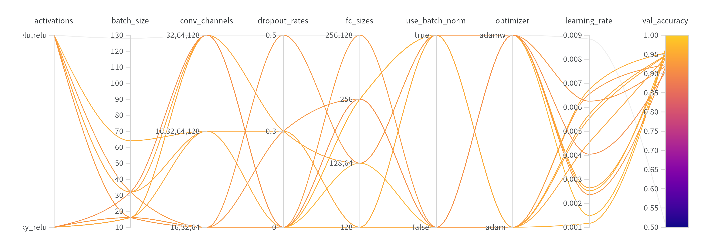

## 2. Part D

Based on the provided parallel coordinates plot, several hyperparameter configurations were explored for the U-Net model. The most relevant parameters and their ranges are:

*   **`use_batchnorm`:**  Boolean (True/False). Indicates whether batch normalization is used in the convolutional blocks.  `True` led to significantly better performance.
*   **`learning_rate`:**  Float (ranging from approximately 0.0025 to 0.0095). Controls the step size during optimization.  Values less than 0.0085 seem optimal based on the parallel coordinates plot.
*   **`filters_base`:** Integer (ranging from approximately 15 to 65).  Determines the number of filters in the first convolutional layer. Higher values generally performed better.
*   **`depth`:** Integer (ranging from 2 to 4).  Represents the depth of the U-Net (number of encoder/decoder blocks). A depth of 3 or 4 appears most effective.
*   **`dropout_rate`**: A value between 0 and 0.13. The experiments show that a lower dropout rate leads to higher val_accuracy.

The parallel coordinates plot shows the relationships between these hyperparameters and the `val_accuracy`.  The lines colored closer to yellow/orange indicate higher validation accuracy.  From the plot, the best performing configurations tend to have:

*   `use_batchnorm`: True
*   `learning_rate`:  Around 0.008 - 0.009
*   `filters_base`:  32 or 64
*   `depth`: 3 or 4
*   `dropout_rate`: Close to 0

 

**Hyperparameter Importance and Correlation:**

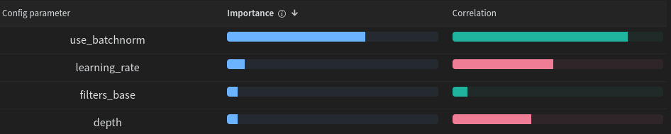

 
**Parallel Coordinates Plot:**

# Results

## 1. Part A

## 2. Part B

The provided graphs illustrate the model performance during the hyperparameter tuning.

**Training Accuracy:**
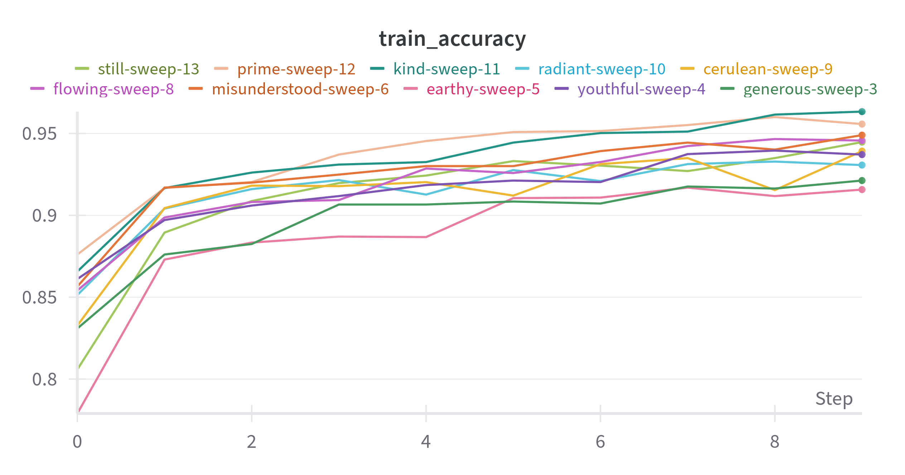
The training accuracy across multiple runs with various hyperparameters.

**Validation Accuracy:**
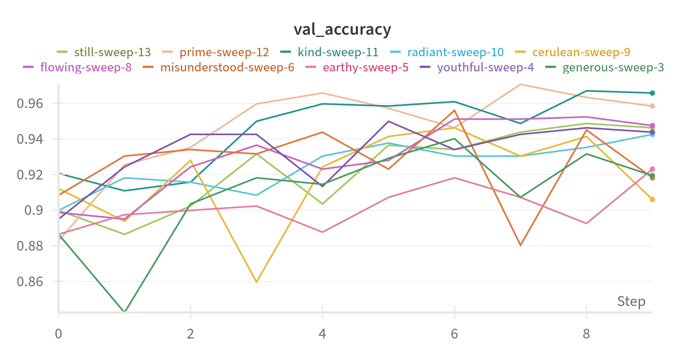
The validation accuracy across multiple runs with various hyperparameters, which reached up to approximately 97%.

**Training Loss:**
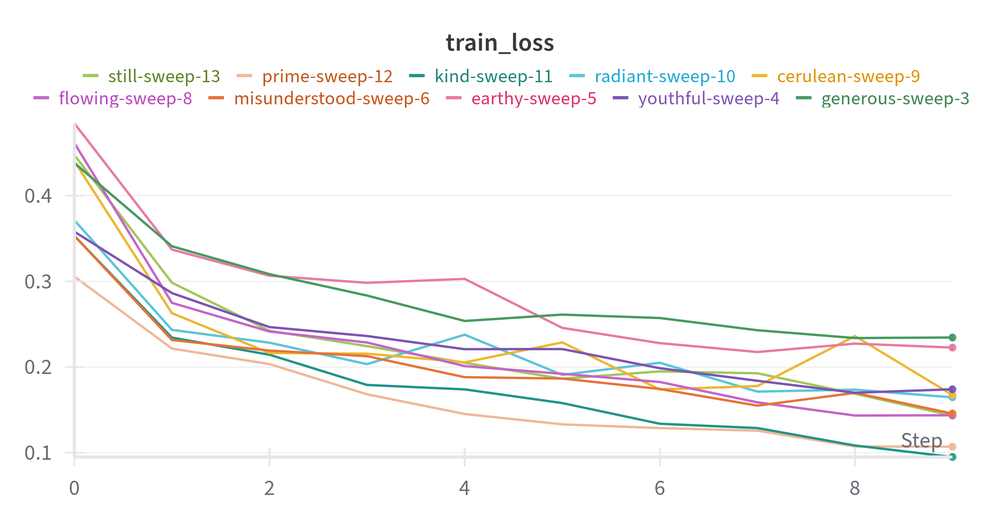
The training loss across multiple runs with various hyperparameters.

**Validation Loss:**
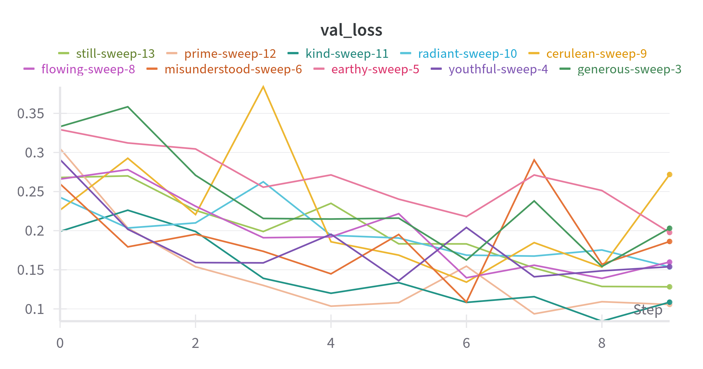
The validation loss across multiple runs with various hyperparameters.

## 3. Part C

After completing the segmentation for each of the 500 images, the average IoU is calculated. It turns out to be <b>0.52</b>. Some of the segmented outputs are shown below along with the ground truths:

<table>
    <tr>
        <th>Segmented Output</th>
        <th>Ground Truth</th>
    </tr>
    <tr>
        <td>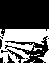</td>
        <td>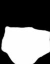</td>
    </tr>
    <tr>
        <td>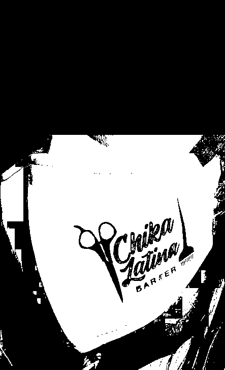</td>
        <td>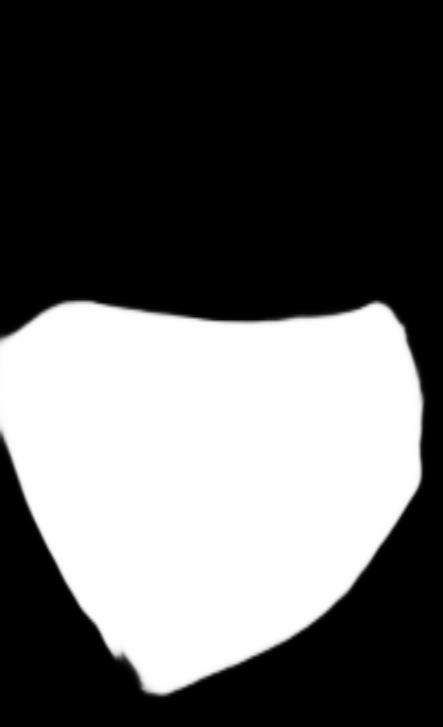</td>
    </tr>
    <tr>
        <td>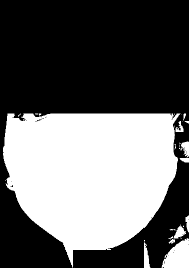</td>
        <td>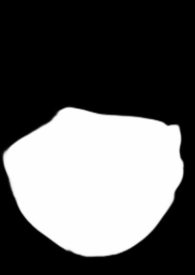</td>
    </tr>
    <tr>
        <td>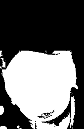</td>
        <td>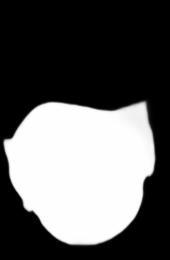</td>
    </tr>
    <tr>
        <td>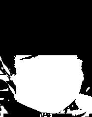</td>
        <td>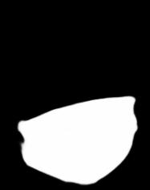</td>
    </tr>
</table>

## 4. Part D

The provided line graphs show the training and validation metrics over 10 epochs for several different U-Net configurations.

**Training Loss:**

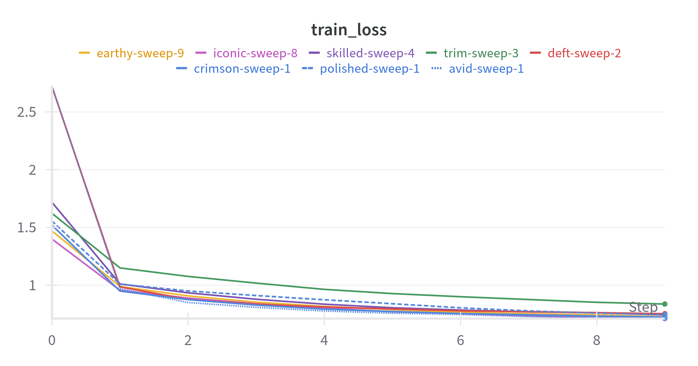

The training loss generally decreases across all runs, with most runs reaching a training loss below 0.8.

 

**Validation Accuracy:**

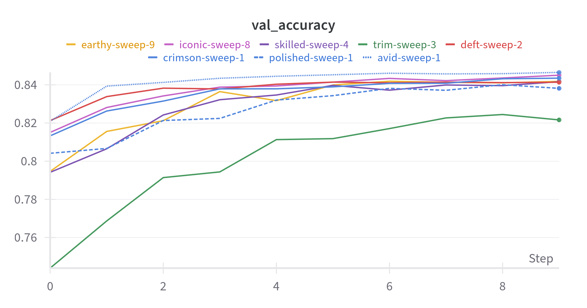

Validation accuracy ranges from approximately 0.75 to 0.85 across the different runs.

 

**Validation Mean Dice:**

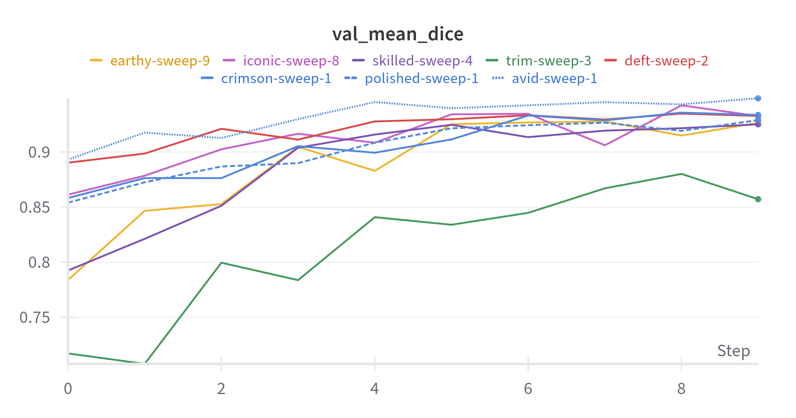

The validation mean Dice score ranges from approximately 0.70 to 0.95.

 

**Validation Mean IOU:**

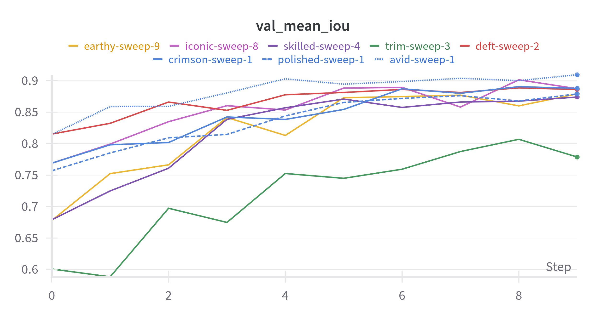

The validation mean IoU score shows a similar trend to the Dice score, ranging from approximately 0.60 to 0.92.

 

**Validation Loss:**

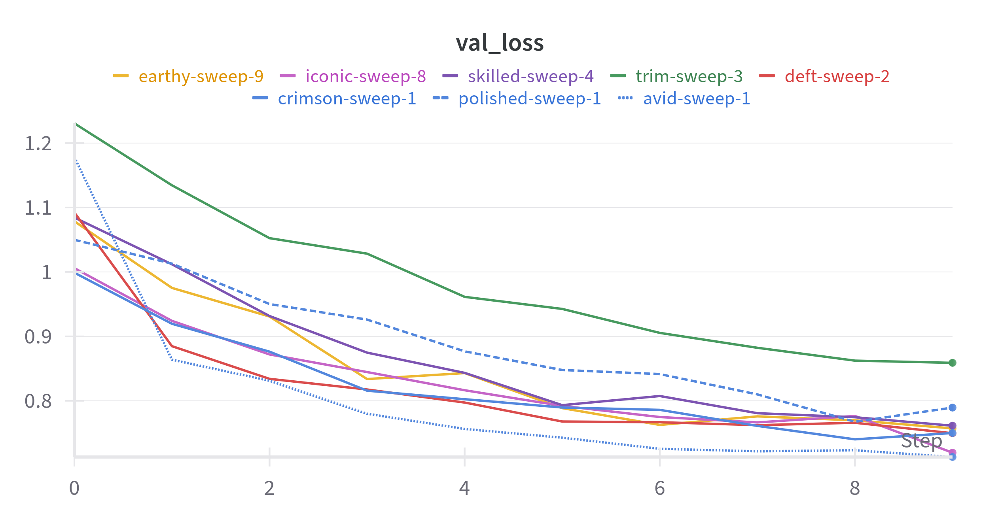

Validation loss values vary between approximately 0.7 and 1.2.

 

**Sample Predictions:**

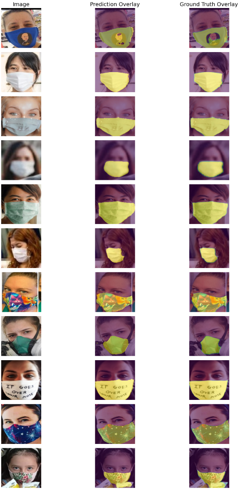

The image above shows a sample of validation images, with columns representing: Original Image, Prediction Overlay, and Ground Truth Overlay from the U-Net model.

## 5. Comparing ML Classifiers with CNN

## 6. Comparing Traditional segmentation techniques with U-Net

# Observations and Analysis

## CNN (Part B)

## Traditional Segmentation (Part C)

**Challenges faced:** 

* Most of the images have edges in the face, and inside the mask region as well. This causes many unnecessary edges to be detected.

* Segmentation on some images resulted in the face being segmented, while the mask region was segmented as background. This was causing a drastic reduction in the average IoU.

**Methods used:**

* To remove unnecessary edges, blurring was done using a Gaussian fileter. However, too much blurring caused the edges near the mask to not be detected.

* To overcome the second problem, two sets of segmented images were generated, as mentioned in the methodology. The segmented image with a greater number of white pixels in the lower region of the image was considered better. This is why both binary as well inverse binary thresholding were performed.

## U-Net (Part D)

# Running the Code
