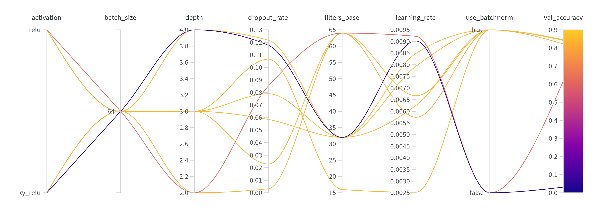

# Introduction

# Setup Instructions

# Dataset

# Methodology

## 1. Part A

## 2. Part B

## 3. Part C

## 4. Part D

The core of Part D focuses on semantic segmentation of face masks in images using a U-Net model.  The steps involved are:

1.  **Data Loading and Preprocessing:**
    *   The `MSFDDataset` class handles loading image-segmentation pairs, resizing them to a consistent size (128x128), converting them to PyTorch tensors, and applying normalization to the image data.
    *   DataLoaders are created for both training and validation sets to efficiently feed data to the model during training.

2.  **Model Definition (U-Net):**
    *   A flexible U-Net architecture (`UNet` class) is implemented.  This allows for configurable depth, base filter count, activation function (ReLU, LeakyReLU, or ELU), batch normalization, and dropout.
    *   The U-Net consists of an encoding path (contracting) and a decoding path (expanding) with skip connections.
    *   The encoding path downsamples the input image through convolutional blocks and max pooling, capturing features at different scales.
    *   The decoding path upsamples the feature maps using transposed convolutions and concatenates them with corresponding feature maps from the encoding path (skip connections).
    *   A final 1x1 convolution maps the output to the number of segmentation classes (256 in this case, representing pixel intensity levels in the grayscale masks).

3.  **Training:**
    *   The model is trained using the Adam optimizer and Cross-Entropy loss.
    *   The `train_model` function performs the training loop:
        *   Iterates through epochs.
        *   For each epoch, iterates through batches of training data.
        *   Performs forward pass, calculates loss, performs backward pass, and updates model weights.
        *   Calculates and logs training loss.
        *   Evaluates the model on the validation set after each epoch.
        *   Calculates and logs validation loss, accuracy, Intersection over Union (IoU), and Dice score.

4.  **Evaluation:**
    *   The trained model is evaluated on the validation set.
    *   Key metrics:
        *   **Validation Loss:** Measures the model's error on the validation set.
        *   **Validation Accuracy:**  The percentage of correctly classified pixels.
        *   **Validation IoU (Intersection over Union):** Measures the overlap between predicted and ground truth masks.
        *   **Validation Dice Score:**  Another measure of overlap, similar to IoU but more sensitive to differences in mask size.

5.  **Prediction and Visualization:**
    * The `create_prediction_grid` function displays a grid of images, predicted segmentation masks (overlaid on the images), and ground truth masks (overlaid on the images) for visual assessment.

# Hyperparameters and Experiments

## 1. Part B

## 2. Part D

Based on the provided parallel coordinates plot, several hyperparameter configurations were explored for the U-Net model. The most relevant parameters and their ranges are:

*   **`use_batchnorm`:**  Boolean (True/False). Indicates whether batch normalization is used in the convolutional blocks.  `True` led to significantly better performance.
*   **`learning_rate`:**  Float (ranging from approximately 0.0025 to 0.0095). Controls the step size during optimization.  Values less than 0.0085 seem optimal based on the parallel coordinates plot.
*   **`filters_base`:** Integer (ranging from approximately 15 to 65).  Determines the number of filters in the first convolutional layer. Higher values generally performed better.
*   **`depth`:** Integer (ranging from 2 to 4).  Represents the depth of the U-Net (number of encoder/decoder blocks). A depth of 3 or 4 appears most effective.
*   **`dropout_rate`**: A value between 0 and 0.13. The experiments show that a lower dropout rate leads to higher val_accuracy.

The parallel coordinates plot shows the relationships between these hyperparameters and the `val_accuracy`.  The lines colored closer to yellow/orange indicate higher validation accuracy.  From the plot, the best performing configurations tend to have:

*   `use_batchnorm`: True
*   `learning_rate`:  Around 0.008 - 0.009
*   `filters_base`:  32 or 64
*   `depth`: 3 or 4
*   `dropout_rate`: Close to 0

 

**Hyperparameter Importance and Correlation:**

 
**Parallel Coordinates Plot:**

# Results

## 1. Part A

## 2. Part B

## 3. Part C

## 4. Part D

The provided line graphs show the training and validation metrics over 10 epochs for several different U-Net configurations.

**Training Loss:**

*Note: Ensure 'images/training_loss.png' exists in the 'images' folder.*

The training loss generally decreases across all runs, with most runs reaching a training loss below 0.8.

 

**Validation Accuracy:**

*Note: Ensure 'images/validation_accuracy.png' exists in the 'images' folder.*

Validation accuracy ranges from approximately 0.75 to 0.85 across the different runs.

 

**Validation Mean Dice:**

The validation mean Dice score ranges from approximately 0.70 to 0.95.

 

**Validation Mean IOU:**

The validation mean IoU score shows a similar trend to the Dice score, ranging from approximately 0.60 to 0.92.

 

**Validation Loss:**

Validation loss values vary between approximately 0.7 and 1.2.

 

**Sample Predictions:**

The image above shows a sample of validation images, with columns representing: Original Image, Prediction Overlay, and Ground Truth Overlay from the U-Net model.

## 5. Comparing ML Classifiers with CNN

## 6. Comparing Traditional segmentation techniques with U-Net

# Observations and Analysis

*   **Batch Normalization:**  The parallel coordinates plot strongly suggests that using batch normalization (`use_batchnorm = True`) significantly improves model performance.

*   **Learning Rate:** A learning rate in the range of 0.008-0.009 appears to be optimal.  Lower learning rates might lead to slower convergence, while higher rates could cause instability.

*   **Filters Base and Depth:**  Increasing the `filters_base` parameter (up to a point) and using a U-Net depth of 3 or 4 generally improves performance. This suggests that a more complex model with more capacity is beneficial for this task.

*   **Dropout Rate:** The lower the dropout rate, the better validation accuracy in general, as per the given parallel coordinate plot.

*   **Overfitting:** While the training loss continues to decrease, the validation loss plateaus or even slightly increases in some runs, suggesting the potential for minor overfitting. However, the validation accuracy and IoU/Dice scores continue to improve (or remain stable), so this overfitting is not severe.

*   **Challenges:** Handling grayscale masks with 256 classes (pixel intensity levels) can be more challenging than binary segmentation (mask/no-mask).  The choice of Cross-Entropy loss is appropriate for this multi-class scenario.

*   **Improvements:** The U-Net training could benefit from a learning rate scheduler, weight decay and early stopping.

# Running the Code
